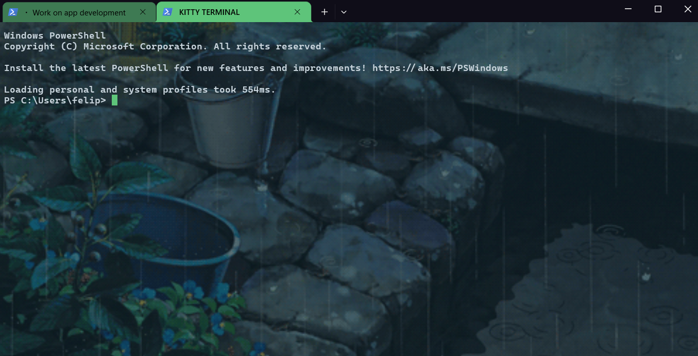
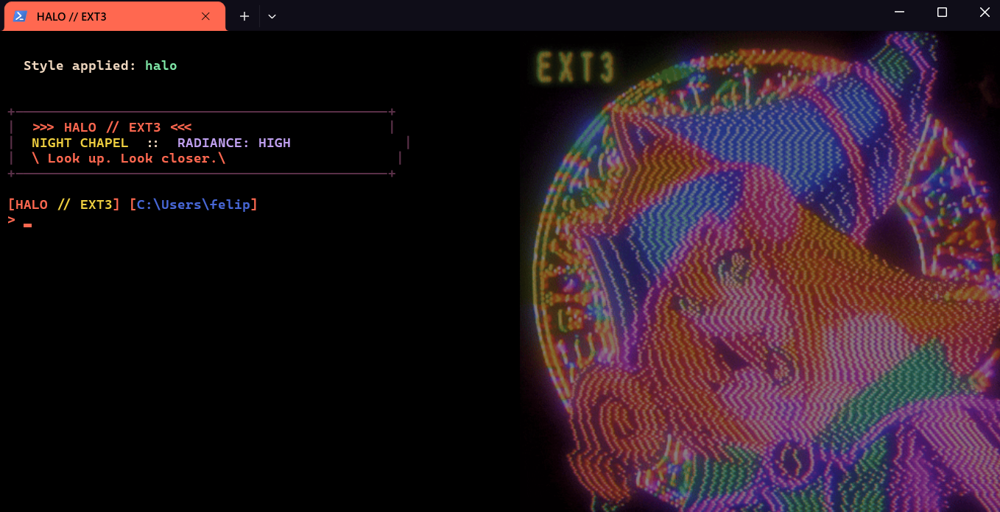
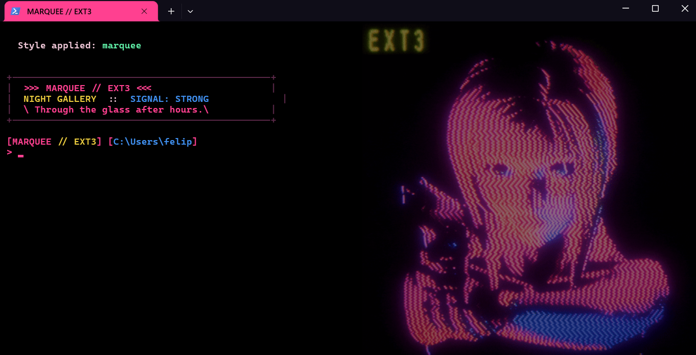

# TerminalStyles

[](https://github.com/fcreme/TerminalStyles/actions/workflows/test.yml)

Themed styles for **PowerShell** (5.1 and 7+) in **Windows Terminal**.
Install once, then run `tstyles` to switch — arrow keys preview each style
live in your current tab, Enter keeps it, Esc cancels.

<table>
  <tr>
    <td align="center"><b>umbrella</b><br></td>
    <td align="center"><b>eva</b><br></td>
    <td align="center"><b>ex-machina</b><br></td>
    <td align="center"><b>forest</b><br></td>
  </tr>
  <tr>
    <td align="center"><b>garden-rain</b><br></td>
    <td align="center"><b>gitbash</b><br></td>
    <td align="center"><b>golden-forest</b><br></td>
    <td align="center"><b>halo</b><br></td>
  </tr>
  <tr>
    <td align="center"><b>kitty</b><br></td>
    <td align="center"><b>lain</b><br></td>
    <td align="center"><b>marquee</b><br></td>
    <td align="center"><b>neon-rain</b><br></td>
  </tr>
  <tr>
    <td align="center"><b>rain</b><br></td>
    <td align="center"><b>snowday</b><br></td>
    <td align="center"><b>sober</b><br></td>
    <td align="center"><b>tombraider</b><br></td>
  </tr>
</table>

## Install

```powershell
Install-PSResource -Name TerminalStyles
Import-Module TerminalStyles -DisableNameChecking
```

Add the `Import-Module` line to your `$PROFILE` so it loads on every
new shell tab. Then:

```powershell
tstyles
```

Arrow keys preview each style live, Enter keeps it, Esc cancels.

### Alternate: bootstrap installer

For setups without [PSResourceGet](https://learn.microsoft.com/en-us/powershell/module/microsoft.powershell.psresourceget/)
(rare on modern Windows; ships natively in pwsh 7.4+), use the
bootstrap one-liner installer instead. It also auto-registers the
loader in your `$PROFILE`:

```powershell
iwr -useb https://raw.githubusercontent.com/fcreme/TerminalStyles/main/install.ps1 | iex
```

This downloads to `%LOCALAPPDATA%\TerminalStyles\`, registers a
loader for every PowerShell engine it finds, and offers to fix
restrictive execution policies if needed. Once it finishes, run
`tstyles` immediately in the same tab.

The bootstrap install and the PSGallery install can coexist —
whichever your `$PROFILE` loads wins; the other is orphaned silently.

## Use

### Interactive picker

```powershell
PS C:\> tstyles
```

Arrow-key menu, with a 5-color swatch next to each style so you can see
the palette before previewing:

```
  Choose a style for 'PowerShell'
  Up/Down to preview, Enter to keep, Esc to cancel

   > umbrella         ██████████
     eva              ██████████
     ex-machina       ██████████
     ...
```

As you arrow up/down, the terminal actually changes in real time — color
scheme, cursor, font, background GIF, opacity. Press **Enter** to keep
the highlighted style, **Esc** to revert to how things looked before
you ran `tstyles`.

### Subcommands

```powershell
tstyles umbrella                  # Apply a specific style directly (no picker)
tstyles list                      # List all themes; '*' marks the active one
tstyles current                   # Print just the active style name
tstyles random                    # Pick a random style and apply it
tstyles update                    # PSGallery: Update-PSResource. Bootstrap: re-run installer.
tstyles uninstall                 # Remove module + strip $PROFILE loader. Preserves user state.
tstyles uninstall -DeleteData     # As above, plus delete %LOCALAPPDATA%\TerminalStyles\ entirely.
```

Tab completion works on the subcommand and style names:
`tstyles u<TAB>` cycles `umbrella`, `uninstall`, `update`.

## Styles

Sixteen themes ship out of the box. Click any name to jump to that style's
folder for full palette / prompt / theme.json details.

### [umbrella](styles/umbrella)


**Resident-Evil / survival-horror.** Blood-red brackets, bone-white text,
three-line classified-doc prompt with a startup banner.
*"Welcome to Umbrella Corporation. Status: FINE."*

### [eva](styles/eva)


**Evangelion / Asuka body-scan.** Coral-red CRT palette with mustard
yellow status overlay. NERV operations banner.
*"Anta baka?"*

### [ex-machina](styles/ex-machina)


**Ava body-scan / Bluebook research.** Cold electric cyan wireframe
with a coral pink accent.
*"You've been programmed and fed by another. Are you bothered?"*

### [forest](styles/forest)


**Quiet alpine wilderness.** Pixel-art mountain vista — snow-tipped
peaks at golden hour, deep evergreen forest, mirror lake. Cool
blue-green base, peach accents. No banner — gentle for long sessions.

### [garden-rain](styles/garden-rain)



**Ghibli-style garden rainfall.** Wet stone steps, a metal bucket
and a blue plastic one catching rainwater, leafy plants with blue
flowers. Cool slate-blue base, plant-green cursor, no banner.

### [gitbash](styles/gitbash)


**Git Bash / MinTTY recreation.** White background, near-black text,
bar cursor, the classic multi-color prompt with live git-branch
detection. The only light-mode theme in the catalog.

### [golden-forest](styles/golden-forest)


**Warm sepia autumn.** Amber and moss palette over deep dark green.
Quiet — no banner, gentle for long sessions.

### [halo](styles/halo)



**EXT3-series LED halo portrait.** Third in the EXT3 dot-matrix
series alongside tombraider and marquee. Psychedelic multi-color
portrait inside a circular halo ring — coral primary, gold EXT3
label, blue and lavender accents. Right-aligned on pure black,
vintage CRT cursor. *"Look up. Look closer."*

### [kitty](styles/kitty)


**Soft pastel CRT.** Pink, lavender, mint pastels. Retro / vintage
cursor, acrylic. The most playful theme in the set.

### [lain](styles/lain)


**Serial Experiments Lain.** Lain at her Navi — tangled cables,
faint red status lights, the teddy bear. Deep blackish base,
lavender-pink monitor glow, vintage CRT cursor.
*"Present day, present time. Hahaha."*

### [marquee](styles/marquee)



**EXT3-series LED marquee.** Hot magenta dot-matrix portrait,
blue arm accents, gold EXT3 label. Pure black canvas, right-aligned
image so text sits on the left half. Sister piece to tombraider.
*"Through the glass, after hours."*

### [neon-rain](styles/neon-rain)


**Cyberpunk rainy night.** District-05 corporate tower, neon yellow
sign, matrix-green displays, lone delivery truck under steady rain.
Deep blue base, neon yellow cursor, matrix-green status accents.
*"The neon never sleeps."*

### [rain](styles/rain)


**Contemplative highland-storm.** Slate-purple stormy sky, moss-yellow
accents, rust for the lone cloaked traveler. Field-journal banner.
*"Still no sign of the others."*

### [snowday](styles/snowday)


**Quiet winter sunset.** Pixel-art creek through a snow-dusted birch
grove, peach-coral light through bare branches, soft dusty mountain
in the distance. Deep dusk-blue base, sunset peach cursor, no banner.

### [sober](styles/sober)


**Minimalist monochrome.** Grayscale with one subtle teal accent, no
banner, single-line prompt. The opposite of umbrella's drama.

### [tombraider](styles/tombraider)


**90s arcade marquee.** LED-pixel TOMB RAIDER sign in hot neon
magenta with Lara's silhouette, gold EXT3 label, cyan highlights.
Pure black base, neon magenta cursor, vintage CRT cursor.
*"Press start."*

---

Screenshots are generated by `scripts/capture-screenshots.ps1` (see
*Adding your own style* below). If they're missing or out of date, run
that script from inside Windows Terminal and commit the output.

## Background image

Each bundled style has its own animated background, hosted on the
[`gifs` branch](https://github.com/fcreme/TerminalStyles/tree/gifs) of
this repo. `tstyles` lazy-fetches each one on first use of the style and
caches it under `%LOCALAPPDATA%\TerminalStyles\styles\<name>\`, so the
install ZIP stays small (~100 KB instead of ~10 MB). Picking a style
auto-applies the image — arrow keys cycle the background live alongside
the colors / cursor / font.

To override the bundled image with your own:

```powershell
tstyles -BackgroundImage "C:\Users\me\Pictures\moody.gif"
```

To disable backgrounds for this style:

```powershell
tstyles -BackgroundImage ""
```

Styles without a bundled image leave your existing background untouched
unless you pass `-BackgroundImage`.

## Requirements

- Windows 10 / 11
- [Windows Terminal](https://aka.ms/terminal) (live preview only shows up
  here — VS Code's integrated terminal etc. won't reflect the changes)
- **Either** Windows PowerShell 5.1 (ships with Windows) **or**
  [PowerShell 7+](https://github.com/PowerShell/PowerShell) (`pwsh`).
  Both engines work.
- For the PSGallery install path (`Install-PSResource`), PowerShell
  7.4+ ships [PSResourceGet](https://learn.microsoft.com/en-us/powershell/module/microsoft.powershell.psresourceget/)
  natively. Older shells can use the bootstrap `iwr | iex` one-liner
  instead — it auto-registers a loader in every PowerShell engine
  it finds.

### Execution policy

If you see `UnauthorizedAccess` / "ejecución de scripts deshabilitada"
on shell startup, your `CurrentUser` execution policy is `Restricted`.
The installer asks to fix this for you. To do it manually:

```powershell
Set-ExecutionPolicy -Scope CurrentUser RemoteSigned
```

(GPO-locked machine policy can override `CurrentUser`. If the install
shows that, ask your admin or run an elevated `Set-ExecutionPolicy` at
`LocalMachine` scope.)

## Scriptable / non-interactive

For dotfiles managers, CI, or anything that needs a one-shot apply (no
menu), there's a direct script:

```powershell
pwsh -File "$env:LOCALAPPDATA\TerminalStyles\apply.ps1" -Style umbrella -Target "PowerShell" -BackgroundImage "C:\img.gif"
```

`apply.ps1` is the same logic as the interactive picker but driven
entirely by flags. It writes a timestamped `settings.json.bak-<timestamp>`
(and a `$PROFILE.bak-<timestamp>` when overwriting one) before applying,
keeping a full audit trail of every run. See `apply.ps1 -?` for the
full parameter list.

### Recovering from a bad direct apply

`tstyles <name>` and `tstyles random` write a rolling backup to
`settings.json.bak` (no timestamp — overwritten on each direct apply)
in the same directory as `settings.json` before each change. To restore
the last-known-good state:

```powershell
$wt = "$env:LOCALAPPDATA\Packages\Microsoft.WindowsTerminal_8wekyb3d8bbwe\LocalState\settings.json"
Copy-Item "$wt.bak" $wt -Force
```

The picker (`tstyles` with no arg) doesn't write a `.bak` — pressing
Esc reverts in-memory to the exact prior bytes. If you need a full
history of changes (rather than just "undo the most recent direct
apply"), use `apply.ps1` instead — it keeps timestamped backups per run.

## Updating

```powershell
tstyles update
```

`tstyles update` detects how the module was installed and delegates:

- **PSGallery (`Install-PSResource`)** → runs `Update-PSResource -Name TerminalStyles`.
- **Bootstrap (`iwr | iex`)** → re-runs the bootstrap one-liner.

After update, open a new tab (or run `Import-Module TerminalStyles -Force -DisableNameChecking`) for the new version to take effect.

### How the update check works

For **bootstrap** installs only, `tstyles` issues at most one
unauthenticated HTTP GET per 24 hours per machine to
`api.github.com/repos/fcreme/TerminalStyles/commits/main` (capped at
2 seconds), comparing the returned commit SHA against the one
recorded at install time in
`%LOCALAPPDATA%\TerminalStyles\.installed-sha`. The 24h throttle is
tracked in `%LOCALAPPDATA%\TerminalStyles\.last-update-check` and
applies even on failure. No authentication, no payload sent, no
analytics.

PSGallery-installed copies skip this check entirely — `Update-PSResource`
handles version comparison internally when you run `tstyles update`.

## Uninstalling

```powershell
tstyles uninstall
```

`tstyles uninstall` detects how the module was installed and delegates:

- **PSGallery** → runs `Uninstall-PSResource -Name TerminalStyles` +
  strips the `Import-Module` loader from your `$PROFILE`.
- **Bootstrap** → removes the install-managed files from
  `%LOCALAPPDATA%\TerminalStyles\` (script files, bundled styles) and
  strips the loader.

**Either path preserves your user state by default** — your active
style (`current-style.ps1`), update-check throttle, and cached
background images stay at `%LOCALAPPDATA%\TerminalStyles\`. You can
reinstall (either path) and pick up where you left off.

To also remove the user state, pass `-DeleteData`:

```powershell
tstyles uninstall -DeleteData
```

Neither path modifies Windows Terminal's `settings.json` — your
current color scheme / cursor / background stays whatever it was
last set to.

If you want a clean default look back, either restore a
`settings.json.bak-<timestamp>` file from
`%LOCALAPPDATA%\Packages\Microsoft.WindowsTerminal_8wekyb3d8bbwe\LocalState\`,
or open WT Settings → "Open JSON file" and edit by hand.

## Adding your own style

Once installed, you can drop a new style folder into your
TerminalStyles install dir with:

```
<name>/
├── scheme.json        # Windows Terminal color scheme (required)
├── theme.json         # profile-level overrides (optional)
├── profile.ps1        # custom pwsh $PROFILE (optional)
├── background.gif     # default background image (optional, .png/.jpg also accepted)
└── README.md          # description (optional)
```

The install dir depends on which install path you used:

- **Bootstrap (`iwr | iex`):** `%LOCALAPPDATA%\TerminalStyles\styles\<name>\`.
- **PSGallery (`Install-PSResource`):** the module's per-version dir,
  e.g. `~\Documents\PowerShell\Modules\TerminalStyles\0.2.0\styles\<name>\`.

`tstyles` will pick it up automatically on next module load — no
registration needed.

**Custom styles don't survive `tstyles update` on either path** — the
installer re-extracts (bootstrap) or installs into a fresh per-version
dir (PSGallery), so user-added folders inside `styles/` aren't carried
over. Your active style (`current-style.ps1`) and any lazy-fetched
backgrounds at `%LOCALAPPDATA%\TerminalStyles\` *are* preserved.

For a custom style you want long-term, the cleanest path is to
contribute it upstream — see "For contributing back" below. If you
want to keep working ones locally between updates, save the folder
somewhere outside `styles/` and re-drop it in after each update.

For contributing back:

1. Fork the repo, add the code-only folder (scheme.json / theme.json /
   profile.ps1 / README.md — no background) under `styles/<name>/` on
   `main`, and open a PR.
2. If your theme ships a background, also switch to the `gifs` branch
   and drop the file at the root as `<name>.<ext>` (flat naming, no
   subfolder). `main` stays code-only; `tstyles` lazy-fetches the
   background on first use of your style.

- **scheme.json** must contain a unique `name`. See
  [Microsoft's docs](https://learn.microsoft.com/en-us/windows/terminal/customize-settings/color-schemes).
- **theme.json** uses the literal string `"{{BACKGROUND_IMAGE}}"` for
  the background image field; `tstyles` substitutes the bundled
  `background.*` (or the user's `-BackgroundImage` flag if passed) and
  strips the field if neither is available.
- **profile.ps1** is copied to `current-style.ps1` on apply and
  dot-sourced from `$PROFILE` on shell startup.
- **background.gif / .png / .jpg / .jpeg** is auto-applied when the style
  is selected. Priority order if multiple exist: `.gif > .png > .jpg >
  .jpeg`. Only contribute images you have the right to redistribute.

After adding a new style, regenerate the screenshot gallery so your
theme shows up in the README:

```powershell
# Must be run from inside a Windows Terminal tab
pwsh -File .\scripts\capture-screenshots.ps1
git add docs/screenshots/
git commit -m "Refresh theme screenshots"
```

`capture-screenshots.ps1` iterates every installed theme, applies it,
takes one PNG of the WT window, then restores your original theme.

## Known limitations

- **One `$PROFILE` per host.** Confirming a style with a custom prompt
  replaces `current-style.ps1`. Switching styles changes the prompt
  globally — there's no per-tab prompt configuration.
- **Preview carryover for bundle-less styles.** Arrow-keying from a style
  with a bundled `background.*` onto a style without one leaves the
  previous GIF visible (the bundle-less path doesn't touch background
  fields). Pass `-BackgroundImage ""` to clear, or just confirm the
  selection.
- **Repo size grows with styles.** Bundled GIFs are committed binaries;
  contributors should keep each under ~2 MB and only submit images they
  have the right to redistribute.
- **Live preview is Windows-Terminal-only.** Other hosts (VS Code,
  conhost) don't read `settings.json`, so the menu won't show theme
  changes there — `tstyles` warns when this is the case.
- **JSON reformatting.** Each apply reformats `settings.json` cosmetically
  (PowerShell's `ConvertTo-Json` style). Functionally identical;
  Windows Terminal rewrites the file on its next save anyway.
- **User state lives at `%LOCALAPPDATA%\TerminalStyles\`** regardless
  of install method. This dir holds your active style, cached
  background images, and the update-check throttle. It survives
  uninstall (unless you pass `-DeleteData`) and version upgrades.
- **Bootstrap + PSGallery installs can coexist.** If you've run both,
  whichever your `$PROFILE` loads first wins; the other is orphaned
  silently. To clean up: `tstyles uninstall` removes whichever is
  currently loaded; run it twice (switching shells between runs if
  needed) to clean both.

## License

MIT — see [LICENSE](LICENSE).
