# TerminalStyles

[](https://github.com/fcreme/TerminalStyles/actions/workflows/test.yml)

Themed styles for **PowerShell** (5.1 and 7+) in **Windows Terminal**.
Install once, then run `tstyles` to switch — arrow keys preview each style
live in your current tab, Enter keeps it, Esc cancels.

<table>
  <tr>
    <td align="center"><b>umbrella</b><br></td>
    <td align="center"><b>eva</b><br></td>
    <td align="center"><b>ex-machina</b><br></td>
    <td align="center"><b>forest</b><br></td>
    <td align="center"><b>gitbash</b><br></td>
  </tr>
  <tr>
    <td align="center"><b>golden-forest</b><br></td>
    <td align="center"><b>kitty</b><br></td>
    <td align="center"><b>lain</b><br></td>
    <td align="center"><b>neon-rain</b><br></td>
    <td align="center"><b>rain</b><br></td>
  </tr>
  <tr>
    <td align="center"><b>snowday</b><br></td>
    <td align="center"><b>sober</b><br></td>
    <td align="center"><b>tombraider</b><br></td>
    <td></td>
    <td></td>
  </tr>
</table>

## Install

Open a **PowerShell** tab in Windows Terminal (either Windows PowerShell
5.1 or PowerShell 7+ works) and run:

```powershell
iwr -useb https://raw.githubusercontent.com/fcreme/TerminalStyles/main/install.ps1 | iex
```

That's it. You don't need to clone anything. The installer:

1. Downloads the styles to `%LOCALAPPDATA%\TerminalStyles\`.
2. Registers a loader line in your `$PROFILE` for **every** PowerShell
   engine it finds on PATH (`pwsh.exe` and `powershell.exe`), so one run
   sets up both shells.
3. Detects if either engine's execution policy is `Restricted` /
   `AllSigned` and offers to set `CurrentUser` to `RemoteSigned` for you
   (it asks first — never silent).

Then open a new pwsh or powershell tab (or run `. $PROFILE` to reload).

## Use

### Interactive picker

```powershell
PS C:\> tstyles
```

Arrow-key menu, with a 5-color swatch next to each style so you can see
the palette before previewing:

```
  Choose a style for 'PowerShell'
  Up/Down to preview, Enter to keep, Esc to cancel

   > umbrella         ██████████
     eva              ██████████
     ex-machina       ██████████
     ...
```

As you arrow up/down, the terminal actually changes in real time — color
scheme, cursor, font, background GIF, opacity. Press **Enter** to keep
the highlighted style, **Esc** to revert to how things looked before
you ran `tstyles`.

### Subcommands

```powershell
tstyles umbrella        # Apply a specific style directly (no picker)
tstyles list            # List all themes; '*' marks the active one
tstyles current         # Print just the active style name
tstyles random          # Pick a random style and apply it
tstyles update          # Pull the latest version from GitHub
tstyles uninstall       # Remove TerminalStyles cleanly (asks confirmation)
```

Tab completion works on the subcommand and style names:
`tstyles u<TAB>` cycles `umbrella`, `uninstall`, `update`.

## Styles

Thirteen themes ship out of the box. Click any name to jump to that style's
folder for full palette / prompt / theme.json details.

### [umbrella](styles/umbrella)

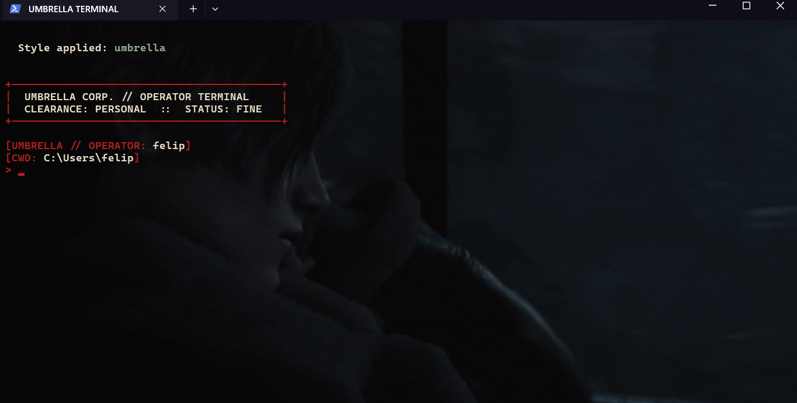

**Resident-Evil / survival-horror.** Blood-red brackets, bone-white text,
three-line classified-doc prompt with a startup banner.
*"Welcome to Umbrella Corporation. Status: FINE."*

### [eva](styles/eva)

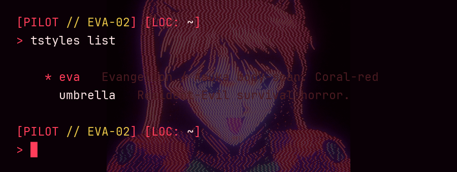

**Evangelion / Asuka body-scan.** Coral-red CRT palette with mustard
yellow status overlay. NERV operations banner.
*"Anta baka?"*

### [ex-machina](styles/ex-machina)

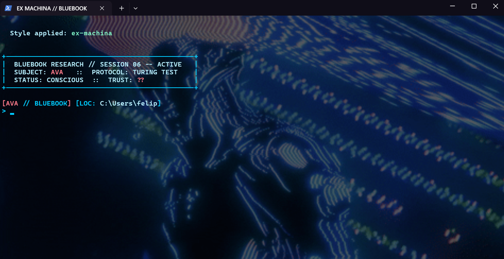

**Ava body-scan / Bluebook research.** Cold electric cyan wireframe
with a coral pink accent.
*"You've been programmed and fed by another. Are you bothered?"*

### [forest](styles/forest)

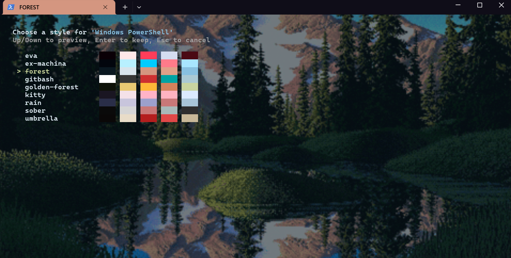

**Quiet alpine wilderness.** Pixel-art mountain vista — snow-tipped
peaks at golden hour, deep evergreen forest, mirror lake. Cool
blue-green base, peach accents. No banner — gentle for long sessions.

### [gitbash](styles/gitbash)

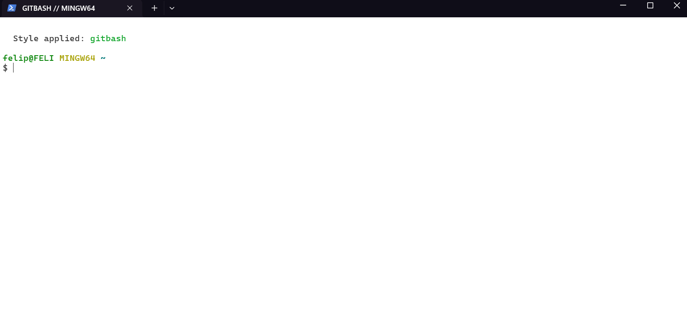

**Git Bash / MinTTY recreation.** White background, near-black text,
bar cursor, the classic multi-color prompt with live git-branch
detection. The only light-mode theme in the catalog.

### [golden-forest](styles/golden-forest)

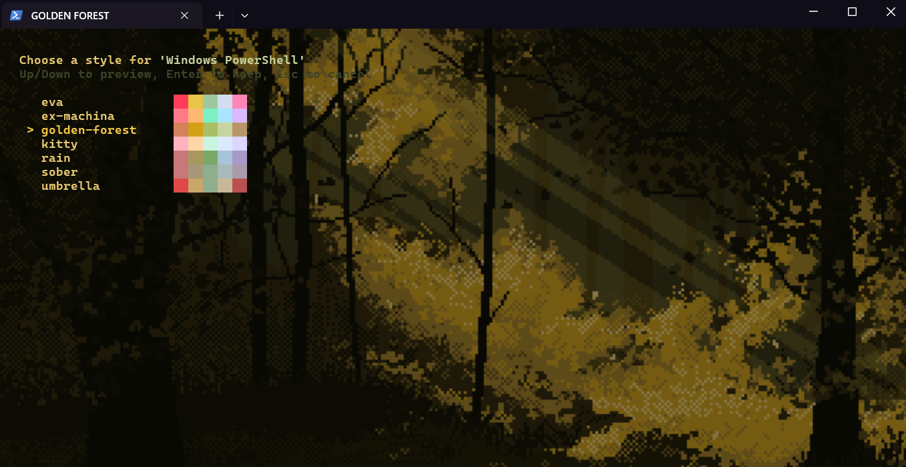

**Warm sepia autumn.** Amber and moss palette over deep dark green.
Quiet — no banner, gentle for long sessions.

### [kitty](styles/kitty)

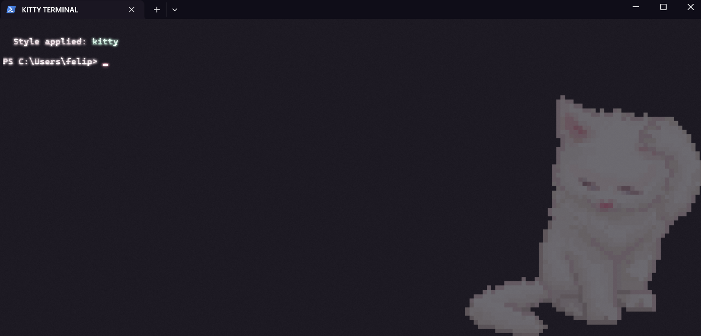

**Soft pastel CRT.** Pink, lavender, mint pastels. Retro / vintage
cursor, acrylic. The most playful theme in the set.

### [lain](styles/lain)

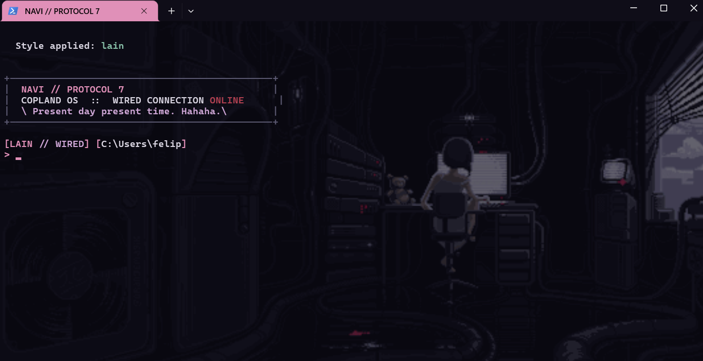

**Serial Experiments Lain.** Lain at her Navi — tangled cables,
faint red status lights, the teddy bear. Deep blackish base,
lavender-pink monitor glow, vintage CRT cursor.
*"Present day, present time. Hahaha."*

### [neon-rain](styles/neon-rain)

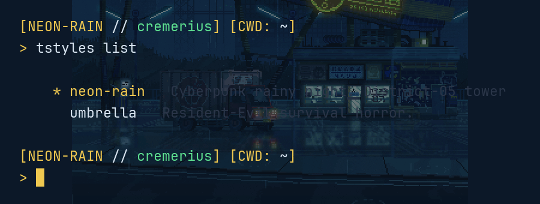

**Cyberpunk rainy night.** District-05 corporate tower, neon yellow
sign, matrix-green displays, lone delivery truck under steady rain.
Deep blue base, neon yellow cursor, matrix-green status accents.
*"The neon never sleeps."*

### [rain](styles/rain)

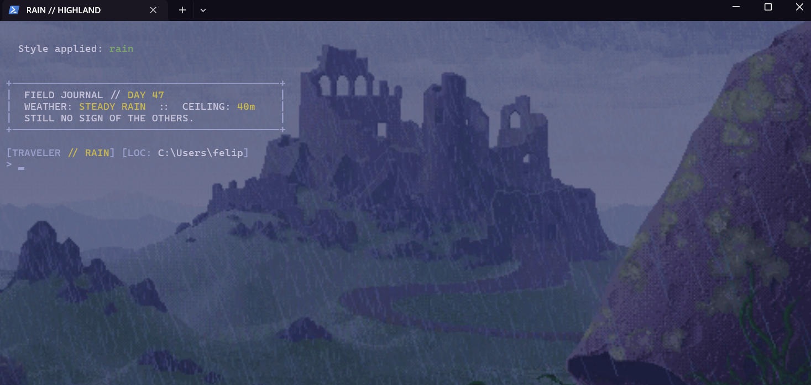

**Contemplative highland-storm.** Slate-purple stormy sky, moss-yellow
accents, rust for the lone cloaked traveler. Field-journal banner.
*"Still no sign of the others."*

### [snowday](styles/snowday)

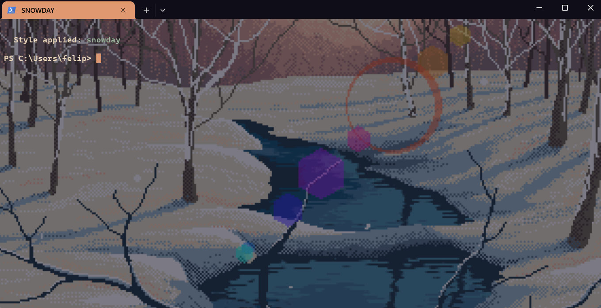

**Quiet winter sunset.** Pixel-art creek through a snow-dusted birch
grove, peach-coral light through bare branches, soft dusty mountain
in the distance. Deep dusk-blue base, sunset peach cursor, no banner.

### [sober](styles/sober)

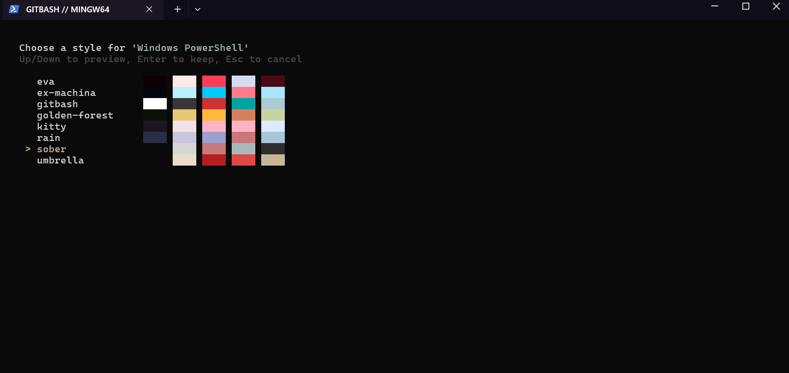

**Minimalist monochrome.** Grayscale with one subtle teal accent, no
banner, single-line prompt. The opposite of umbrella's drama.

### [tombraider](styles/tombraider)

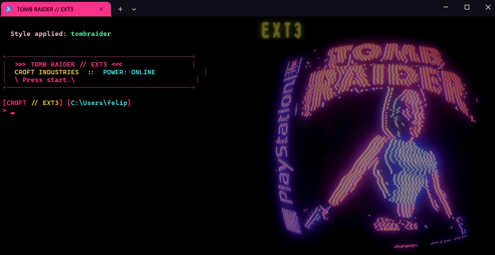

**90s arcade marquee.** LED-pixel TOMB RAIDER sign in hot neon
magenta with Lara's silhouette, gold EXT3 label, cyan highlights.
Pure black base, neon magenta cursor, vintage CRT cursor.
*"Press start."*

---

Screenshots are generated by `scripts/capture-screenshots.ps1` (see
*Adding your own style* below). If they're missing or out of date, run
that script from inside Windows Terminal and commit the output.

## Background image

Each bundled style has its own animated background, hosted on the
[`gifs` branch](https://github.com/fcreme/TerminalStyles/tree/gifs) of
this repo. `tstyles` lazy-fetches each one on first use of the style and
caches it under `%LOCALAPPDATA%\TerminalStyles\styles\<name>\`, so the
install ZIP stays small (~100 KB instead of ~10 MB). Picking a style
auto-applies the image — arrow keys cycle the background live alongside
the colors / cursor / font.

To override the bundled image with your own:

```powershell
tstyles -BackgroundImage "C:\Users\me\Pictures\moody.gif"
```

To disable backgrounds for this style:

```powershell
tstyles -BackgroundImage ""
```

Styles without a bundled image leave your existing background untouched
unless you pass `-BackgroundImage`.

## Requirements

- Windows 10 / 11
- [Windows Terminal](https://aka.ms/terminal) (live preview only shows up
  here — VS Code's integrated terminal etc. won't reflect the changes)
- **Either** Windows PowerShell 5.1 (ships with Windows) **or**
  [PowerShell 7+](https://github.com/PowerShell/PowerShell) (`pwsh`).
  Both engines work; if both are installed, the one-liner sets up both.

### Execution policy

If you see `UnauthorizedAccess` / "ejecución de scripts deshabilitada"
on shell startup, your `CurrentUser` execution policy is `Restricted`.
The installer asks to fix this for you. To do it manually:

```powershell
Set-ExecutionPolicy -Scope CurrentUser RemoteSigned
```

(GPO-locked machine policy can override `CurrentUser`. If the install
shows that, ask your admin or run an elevated `Set-ExecutionPolicy` at
`LocalMachine` scope.)

## Scriptable / non-interactive

For dotfiles managers, CI, or anything that needs a one-shot apply (no
menu), there's a direct script:

```powershell
pwsh -File "$env:LOCALAPPDATA\TerminalStyles\apply.ps1" -Style umbrella -Target "PowerShell" -BackgroundImage "C:\img.gif"
```

`apply.ps1` is the same logic as the interactive picker but driven
entirely by flags, with a one-time backup of `settings.json` and
`$PROFILE` before applying. See `apply.ps1 -?` for the full parameter
list.

## Updating

Every `tstyles` invocation checks `api.github.com` for new commits on
`main` and prints a one-line yellow notice if your install is behind:

```
Update available (abc1234 -> def5678). Run: tstyles update
```

To pull the update:

```powershell
tstyles update
```

This re-runs the install one-liner against the latest `main`. Your
currently selected style (`current-style.ps1`) is preserved across
reinstalls. Add `-Force` to skip the same-SHA fast-path and reinstall
anyway (useful for recovering from a botched install).

If `tstyles update` fails (no internet, GitHub down, corporate proxy),
the original install one-liner still works:

```powershell
iwr -useb https://raw.githubusercontent.com/fcreme/TerminalStyles/main/install.ps1 | iex
```

### How the update check works

`tstyles` issues a single unauthenticated HTTP GET to
`api.github.com/repos/fcreme/TerminalStyles/commits/main` on every
invocation (capped at 2 seconds), comparing the returned commit SHA
against the one recorded at install time in `%LOCALAPPDATA%\TerminalStyles\.installed-sha`.
No authentication, no payload sent, no analytics. Offline / API
unreachable / rate-limited → check fails silently and `tstyles` works
normally.

## Uninstalling

```powershell
tstyles uninstall
```

Asks for confirmation, then removes `%LOCALAPPDATA%\TerminalStyles\` and
strips the loader block from both pwsh 7 and Windows PowerShell 5.1
`$PROFILE` files. **Does not modify `settings.json`** — your color
scheme / cursor / background stays whatever it was last set to.

If you want a clean default look back, either restore a
`settings.json.bak-<timestamp>` file from
`%LOCALAPPDATA%\Packages\Microsoft.WindowsTerminal_8wekyb3d8bbwe\LocalState\`,
or open WT Settings → "Open JSON file" and edit by hand.

If `tstyles uninstall` isn't available (e.g., the loader is broken), the
manual equivalent is:

```powershell
Remove-Item "$env:LOCALAPPDATA\TerminalStyles" -Recurse -Force

$content = Get-Content $PROFILE -Raw
$content = [regex]::Replace($content, '(?ms)# ===== TerminalStyles BEGIN =====.*?# ===== TerminalStyles END =====\r?\n?', '')
[System.IO.File]::WriteAllText($PROFILE, $content, [System.Text.UTF8Encoding]::new($false))
```

## Adding your own style

Once installed, you can drop a new style folder into
`%LOCALAPPDATA%\TerminalStyles\styles\<name>\` with:

```
<name>/
├── scheme.json        # Windows Terminal color scheme (required)
├── theme.json         # profile-level overrides (optional)
├── profile.ps1        # custom pwsh $PROFILE (optional)
├── background.gif     # default background image (optional, .png/.jpg also accepted)
└── README.md          # description (optional)
```

`tstyles` will pick it up automatically — no registration needed.

For contributing back:

1. Fork the repo, add the code-only folder (scheme.json / theme.json /
   profile.ps1 / README.md — no background) under `styles/<name>/` on
   `main`, and open a PR.
2. If your theme ships a background, also switch to the `gifs` branch
   and drop the file at the root as `<name>.<ext>` (flat naming, no
   subfolder). `main` stays code-only; `tstyles` lazy-fetches the
   background on first use of your style.

- **scheme.json** must contain a unique `name`. See
  [Microsoft's docs](https://learn.microsoft.com/en-us/windows/terminal/customize-settings/color-schemes).
- **theme.json** uses the literal string `"{{BACKGROUND_IMAGE}}"` for
  the background image field; `tstyles` substitutes the bundled
  `background.*` (or the user's `-BackgroundImage` flag if passed) and
  strips the field if neither is available.
- **profile.ps1** is copied to `current-style.ps1` on apply and
  dot-sourced from `$PROFILE` on shell startup.
- **background.gif / .png / .jpg / .jpeg** is auto-applied when the style
  is selected. Priority order if multiple exist: `.gif > .png > .jpg >
  .jpeg`. Only contribute images you have the right to redistribute.

After adding a new style, regenerate the screenshot gallery so your
theme shows up in the README:

```powershell
# Must be run from inside a Windows Terminal tab
pwsh -File .\scripts\capture-screenshots.ps1
git add docs/screenshots/
git commit -m "Refresh theme screenshots"
```

`capture-screenshots.ps1` iterates every installed theme, applies it,
takes one PNG of the WT window, then restores your original theme.

## Known limitations

- **One `$PROFILE` per host.** Confirming a style with a custom prompt
  replaces `current-style.ps1`. Switching styles changes the prompt
  globally — there's no per-tab prompt configuration.
- **Preview carryover for bundle-less styles.** Arrow-keying from a style
  with a bundled `background.*` onto a style without one leaves the
  previous GIF visible (the bundle-less path doesn't touch background
  fields). Pass `-BackgroundImage ""` to clear, or just confirm the
  selection.
- **Repo size grows with styles.** Bundled GIFs are committed binaries;
  contributors should keep each under ~2 MB and only submit images they
  have the right to redistribute.
- **Live preview is Windows-Terminal-only.** Other hosts (VS Code,
  conhost) don't read `settings.json`, so the menu won't show theme
  changes there — `tstyles` warns when this is the case.
- **JSON reformatting.** Each apply reformats `settings.json` cosmetically
  (PowerShell's `ConvertTo-Json` style). Functionally identical;
  Windows Terminal rewrites the file on its next save anyway.

## License

MIT — see [LICENSE](LICENSE).
